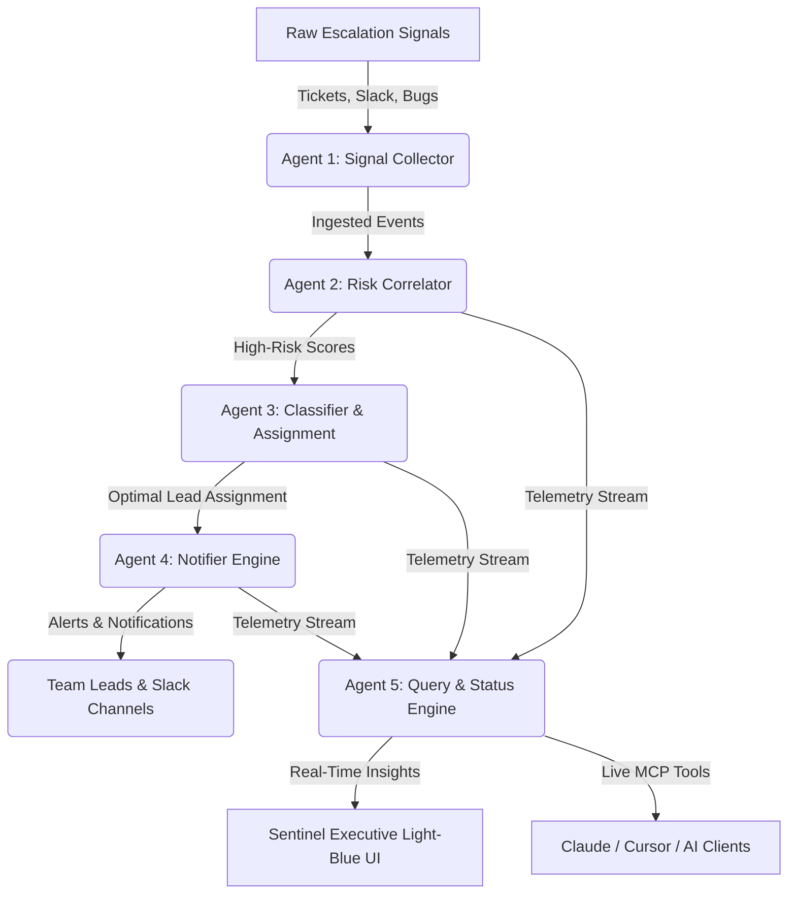

# Sentinel TriAge Hub - Support Ticket Manager

> *One unhappy customer, three disconnected tools, and no clear owner.*  
> **Sentinel TriAge Hub** unifies customer signals across Tickets, Slack, and Bug Trackers into an autonomous 5-Agent MCP Swarm — detecting churn risk early, balancing lead workloads, and resolving escalations before SLA breaches occur.


---

## ⚡ Quick Links

* 🌐 **Live Web Application:** [https://esclation-triag-multi-agent-mafias-amrita-university-coimbatore.cloud.nitrostack.ai/ui](https://esclation-triag-multi-agent-mafias-amrita-university-coimbatore.cloud.nitrostack.ai/ui)
* ⚡ **Live MCP Cloud Endpoint:** `https://esclation-triag-multi-agent-mafias-amrita-university-coimbatore.cloud.nitrostack.ai/mcp`
* 📦 **GitHub Repository:** [shrimanasa/escalation-triage-mcp](https://github.com/shrimanasa/escalation-triage-mcp)

---

## 📋 Table of Contents

- [Overview](#overview)
- [Architecture & 5-Agent Swarm](#architecture--5-agent-swarm)
- [What is MCP?](#what-is-mcp)
- [Features](#features)
- [Live Demo](#live-demo)
- [Getting Started](#getting-started)
- [Connect to an MCP Client](#connect-to-an-mcp-client)
- [Deploy Your Own MCP App](#deploy-your-own-mcp-app)
- [Explore More MCP Apps](#explore-more-mcp-apps)
- [FAQ](#faq)
- [Keywords](#keywords)
- [License](#license)

---

## 📌 Overview

Enterprise support teams struggle with fragmented escalation signals scattered across Zendesk tickets, angry Slack threads, and unassigned GitHub bug reports. When high-value customers face unresolved issues, no single team member has complete context, leading to SLA violations and costly customer churn.

**Sentinel TriAge Hub** acts as an intelligent command center. Built on the **Model Context Protocol (MCP)** using **NitroStack** and integrated with **Google Gemini LLM**, it automatically ingests multi-channel signals, calculates customer risk scores, balances lead capacity, and provides an executive Light-Blue Web UI for real-time triage operations.

---

## 🤖 Architecture & 5-Agent Swarm

Sentinel operates as a coordinated 5-Agent autonomous swarm backed by **11 production MCP tools**:



### 🛠️ The 11 MCP Backend Tools

| Tool Category | Tool Name | Description |
| :--- | :--- | :--- |
| **Signal Collection** | `collect_signal` | Ingests tickets, Slack messages, and bug reports into the triage queue. |
| | `ingest_support_ticket` | Normalizes incoming Zendesk/Intercom support tickets. |
| | `ingest_slack_escalation` | Captures urgent customer messages from Slack channels. |
| **Risk & Correlation** | `calculate_correlation` | Analyzes cross-channel signals and computes customer account churn risk. |
| | `assess_account_risk` | Evaluates SLA breach risk based on pending query timestamps. |
| **Classification** | `classify_escalation` | Categorizes issues by severity, domain, and priority. |
| | `assign_lead` | Matches tickets with optimal lead capacity meters (e.g. John, Ammy). |
| **Notification** | `notify_assignee` | Sends targeted resolution notifications to assigned team leads. |
| | `dispatch_slack_alert` | Posts real-time urgent escalation banners into team channels. |
| **Telemetry & Queries** | `query_status` | Returns pipeline statistics and active query status logs. |
| | `get_lead_workload` | Retrieves lifetime ticket volume and latest resolution timestamps per lead. |

---

## 💡 What is MCP?

The **Model Context Protocol (MCP)** is an open standard that lets AI assistants securely connect to external tools, data sources, and enterprise services. Instead of being limited to static training data, an AI model can call **MCP servers** to fetch live database context, trigger workflows, and perform real-world actions.

This project is a production-grade MCP server deployed on [NitroStack](https://nitrostack.ai).

---

## ✨ Features

- 🔌 **MCP-Native Architecture** — Seamlessly integrates with Claude Desktop, Cursor, and any MCP-compliant client.
- 🩵 **High-End Executive UI** — Custom Light-Blue glassmorphism dashboard featuring:
  - 🏢 **Customer Details Inspector:** Live churn risk indicators (High/Medium/Low).
  - 👤 **Leads & Workload Meter:** Capacity monitoring, lifetime ticket counts, and resolution timestamps.
  - ❓ **Pending Queries Log:** Real-time audit log of customer inquiries across channels.
  - 🤖 **AI Assistant Chatbot:** Google Gemini integration with strict context verification and negative-knowledge detection.
- ⚡ **NitroCloud Deployment** — Deployed on containerized cloud infrastructure with health probes and instant HTTP transport.
- 🔐 **Zero Hallucination AI** — Explicit negative-knowledge handling ensures missing database records are reported accurately without generic fallbacks.

---

## 🚀 Live Demo

* 🌐 **Executive Light-Blue Web UI:**  
  [https://esclation-triag-multi-agent-mafias-amrita-university-coimbatore.cloud.nitrostack.ai/ui](https://esclation-triag-multi-agent-mafias-amrita-university-coimbatore.cloud.nitrostack.ai/ui)

* ⚡ **Live MCP Endpoint for AI Clients:**  
  `https://esclation-triag-multi-agent-mafias-amrita-university-coimbatore.cloud.nitrostack.ai/mcp`

---

## ⚙️ Getting Started

### Prerequisites

* **Node.js**: v18.0.0 or higher
* **npm**: v9.0.0 or higher
* **MCP Client**: Cursor, Claude Desktop, or NitroStudio

### Local Installation

```bash
# Clone the repository
git clone https://github.com/shrimanasa/escalation-triage-mcp.git

# Navigate to project directory
cd escalation-triage-mcp

# Install dependencies
npm install
```

### Environment Configuration

Create a `.env` file in the root directory:

```env
PORT=3000
NODE_ENV=production
VITE_GEMINI_API_KEY=your_google_gemini_api_key_here
```

### Build & Run Locally

```bash
# Build production bundle with NitroStack CLI
npx nitrostack-cli build

# Start production server
npm start
```

Your server will run at `http://localhost:3000/mcp` with the Web UI hosted at `http://localhost:3000/ui`.

---

## 🔌 Connect to an MCP Client

Add Sentinel TriAge Hub to your MCP client configuration (e.g., Cursor or Claude Desktop):

```json
{
  "mcpServers": {
    "sentinel-triage-hub": {
      "url": "https://esclation-triag-multi-agent-mafias-amrita-university-coimbatore.cloud.nitrostack.ai/mcp"
    }
  }
}
```

Restart your client to gain instant access to all **11 MCP tools** inside your AI workspace.

---

## ☁️ Deploy Your Own MCP App

Want to build and ship custom MCP servers? **[NitroStack](https://nitrostack.ai)** allows you to create, test, and deploy production-grade MCP applications in minutes with full containerized hosting.

👉 **Start building:** [https://nitrostack.ai](https://nitrostack.ai)

---

## 🌌 Explore More MCP Apps

- 🌙 Join the community and discover new MCP projects on [r/mcptothemoon](https://www.reddit.com/r/mcptothemoon/)
- 🧰 Browse curated MCP templates and server catalogs on [NitroStack Apps](https://nitrostack.ai/apps)

---

## ❓ FAQ

### What is an MCP Server?
An MCP server implements the Model Context Protocol to expose structured tools, resources, and prompts to AI models, enabling autonomous decision-making with real-time enterprise data.

### What problem does Sentinel TriAge Hub solve?
It eliminates fragmented customer support escalations by unifying signals across Zendesk, Slack, and GitHub issues into an automated 5-agent triage workflow that prevents SLA breaches and churn.

### Which AI clients are supported?
Any MCP-compliant client, including Cursor, Claude Desktop, OpenAI Swarm agents, and custom MCP runners.

### How does the Web UI integrate with the MCP backend?
The Light-Blue Web UI is served directly from the production server, consuming the same underlying data models, risk engines, and LLM services as the MCP backend.

---

## 🏷️ Keywords

`Enterprise AI` · `Support Escalation Triage` · `Model Context Protocol` · `MCP Server` · `NitroStack` · `Multi-Agent Swarm` · `Google Gemini API` · `Customer Churn Prevention` · `SLA Monitoring` · `React Web UI` · `NitroCloud`

---

## 📄 License

Distributed under the MIT License. See `LICENSE` for details.

---

<p align="center">
  Built with ❤️ using <b>Model Context Protocol</b> & <b>NitroStack</b>
</p>
